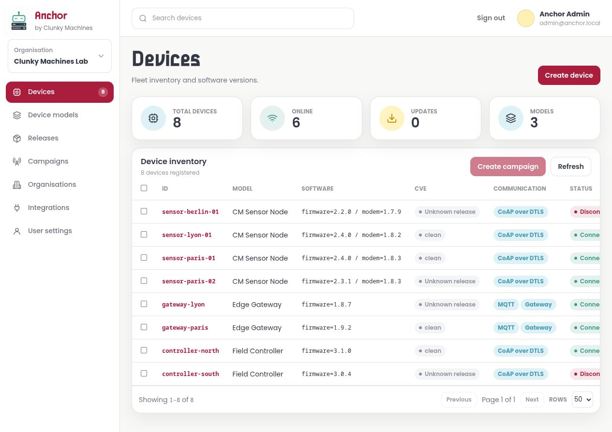

# Anchor

<p align="center">
  
</p>

Anchor is a web application for managing connected-device fleets. It brings device inventory, telemetry, remote tasks, firmware releases, campaigns, and software vulnerability tracking into one place.



Anchor is in technical preview. Database changes are applied automatically by startup migrations.

## What You Can Do

- Organise devices by organisation and device model.
- Monitor device connectivity, reported software versions, telemetry, and raw events.
- Send read, write, and firmware-update tasks to individual devices.
- Run tasks across selected devices as campaigns and track their results.
- Store firmware releases and associate an expected release with each device model.
- Upload SPDX SBOMs and review CVEs detected in firmware releases.
- Provision devices through organisation-scoped API credentials.
- Connect MQTT devices through Mosquitto, including gateway devices.
- Connect constrained devices through CoAP over DTLS 1.2 with per-device PSKs and optional Connection IDs (CID).

## Quick Start

### Requirements

- Go 1.24 or newer
- SQLite, included and used by default

Mosquitto is only required when connecting MQTT devices. Grype is only required when scanning release SBOMs for CVEs.

CoAP/DTLS support is provided by the included `coap-frontend` process; it does not require a separate CoAP server.

### Start Anchor

From the repository root, set a password for the initial Anchor administrator and run the server:

```sh
ANCHOR_ADMIN_PASSWORD='choose-a-password' go run .
```

`go run` reports the development version. To inject the version derived from the nearest Git tag and commit, use `make run` instead.

Open [http://localhost:8080](http://localhost:8080) and sign in with:

- Email: `admin@anchor.local`
- Password: the value supplied in `ANCHOR_ADMIN_PASSWORD`

Anchor creates `anchor.db`, the administrator account, and a personal organisation on the first run. Bootstrap account settings only apply when creating the first user, so set them before starting with a new database.

For a disposable local start, the default password is `anchor`. Do not use that default outside local development.

## Builds and GitHub Releases

Build local `anchor` and `coap-frontend` binaries with a version derived from `git describe`:

```sh
make build
```

Anchor prints that version as soon as it starts. Untagged builds include the commit and a `-dirty` suffix when the working tree has changes.

To publish a GitHub release, create and push a semantic-version tag:

```sh
git tag -a v0.1.0 -m "Anchor v0.1.0"
git push origin v0.1.0
```

The release workflow tests the repository, builds Linux amd64 and arm64 archives containing `anchor` and `coap-frontend`, generates SHA-256 checksums, and creates the GitHub release with generated release notes.

## Connect Your First Device

Open **Device models** and create a model with its expected heartbeat interval and protocol, then follow the matching setup below.

### MQTT

1. Configure Mosquitto to use Anchor for authentication and ACL checks. See [MQTT setup](MQTT.md#mosquitto-setup).
2. As an Anchor administrator, open **Integrations**, configure **MQTT with Mosquitto**, and activate it.
3. Confirm that **Broker connection** reports **Connected**. If it does not, Anchor displays the latest connection reason.
4. Open **Devices**, create a device, choose the MQTT model, and set its username and password.
5. Configure the device with the displayed data and task topics, then connect it to Mosquitto.

The MQTT payload and topic contract is documented in [MQTT.md](MQTT.md).

### CoAP over DTLS

Start Anchor and the included CoAP frontend in separate terminals with the same high-entropy internal bearer token:

```sh
COAP_INTERNAL_BEARER_TOKEN='choose-a-long-random-token' go run .
```

```sh
COAP_INTERNAL_BEARER_TOKEN='choose-a-long-random-token' go run ./cmd/coap-frontend
```

Then:

1. As an Anchor administrator, open **Integrations**, set the CoAP frontend URL to `http://127.0.0.1:8081`, enter the same bearer token, and activate the integration.
2. Open **Devices**, create a device using a CoAP model, and retain the generated PSK; it is displayed only once.
3. Configure the device for CoAPS on UDP port `5684` with the displayed PSK identity and key.
4. Implement the Confirmable CBOR resources used for telemetry, heartbeats, task status, and remote operations.

Expose only the CoAPS/DTLS UDP listener to devices. Keep the frontend control listener and Anchor's internal CoAP API on a trusted private network. The resource contract, supported DTLS cipher suites, CID behavior, limits, and complete configuration are documented in [COAP.md](COAP.md).

Open the device in Anchor to inspect telemetry, raw events, current twin values, software versions, and tasks regardless of the selected protocol.

## Core Workflows

### Devices and Telemetry

The **Devices** page shows fleet connectivity, model, software, CVE, and communication status. A device detail page combines:

- current materialised telemetry values;
- recent raw device events;
- reported software versions;
- communication credentials, MQTT topics, or CoAP PSK identity;
- active and recent tasks.

Device connectivity is calculated from the heartbeat interval configured on its model.

### Tasks and Campaigns

Use a device detail page to launch a task for one device:

- **Read** requests one or more telemetry paths.
- **Write** sends typed values to device paths.
- **FOTA** asks a device to install a firmware release.

Select devices from the inventory and choose **Create campaign** to launch the same task across a group. Anchor tracks queued, pending, in-progress, successful, failed, expired, and canceled work.

### Firmware Releases and CVEs

Create a release for a device model by uploading its firmware binary and, optionally, SPDX SBOM files. Anchor can:

- deliver the release through FOTA tasks;
- compare a device's reported firmware version with the model's expected release;
- scan the SBOM with Grype;
- group active CVEs by severity;
- record CVEs marked as not relevant.

Install `grype` on the server `PATH`, or configure `ANCHOR_GRYPE_PATH`, to enable scanning. A missing or failed scanner is reported in the release scan history and can be retried from the release page.

### Organisations and Access

Every user belongs to at least one organisation. Use the organisation picker to switch the fleet currently being managed.

- **Anchor administrators** can access every organisation and configure application-wide integrations.
- **Organisation administrators** can rename their organisation, invite or remove members, and manage API credentials.
- **Organisation members** can work with resources in organisations they belong to.

Invitation links let new users set their display name and password before joining an organisation.

## Configuration

Anchor reads application and bootstrap settings from environment variables:

| Variable | Default | Purpose |
| --- | --- | --- |
| `ANCHOR_HTTP_ADDR` | `:8080` | HTTP listen address |
| `ANCHOR_DB_DIALECT` | `sqlite` | `sqlite`, `postgres`, or `postgresql` |
| `ANCHOR_DB_PATH` | `anchor.db` | SQLite database path |
| `ANCHOR_DB_DSN` | none | Database DSN; required for PostgreSQL |
| `ANCHOR_ADMIN_EMAIL` | `admin@anchor.local` | Bootstrap administrator email |
| `ANCHOR_ADMIN_NAME` | `Anchor Admin` | Bootstrap administrator display name |
| `ANCHOR_ADMIN_PASSWORD` | `anchor` | Bootstrap administrator password |
| `ANCHOR_FOTA_DOWNLOAD_BASE_URL` | none | Absolute public HTTP(S) URL used in relayed API and CoAP FOTA tasks |
| `ANCHOR_GRYPE_PATH` | `grype` from `PATH` | Grype executable used for CVE scans |
| `ANCHOR_COAP_ENABLED` | unset/disabled | Enable the CoAP frontend integration |
| `ANCHOR_COAP_FRONTEND_URL` | unset | Private HTTP base URL of `coap-frontend` |
| `COAP_INTERNAL_BEARER_TOKEN` | unset | Shared private bearer token for Anchor/frontend |

MQTT connection settings are stored in Anchor and managed from **Integrations**, not through environment variables.

SQLite is the tested database path. A PostgreSQL schema and PostgreSQL-specific queries are implemented, but there is currently no automated PostgreSQL integration suite. Treat PostgreSQL support as experimental.

## MQTT Connection Status

The **Integrations** page reports the internal MQTT client's live broker state:

- **Disabled**: the integration is inactive.
- **Connecting**: Anchor is waiting for the broker connection.
- **Connected**: the broker connection is established.
- **Reconnecting**: an established connection was lost and Anchor is retrying.
- **Connection failed**: the latest connection attempt failed; the broker error is shown on the page.

The status refreshes automatically. Common causes of failure include an unreachable broker URL, rejected internal-client credentials, and Mosquitto listener or TLS configuration errors.

## Further Documentation

- [MQTT protocol and Mosquitto setup](MQTT.md)
- [CoAP/DTLS protocol and frontend setup](COAP.md)
- [Application-backend device API](API-DEVICE.md)
- [Fleet simulator](SIMULATOR.md)
- [Contributing](CONTRIBUTING.md)
- [License](LICENSE)

## License

Anchor is licensed under the GNU Affero General Public License v3.0. Contributions require a signed [Contributor Copyright Assignment Agreement](CLA.md).
